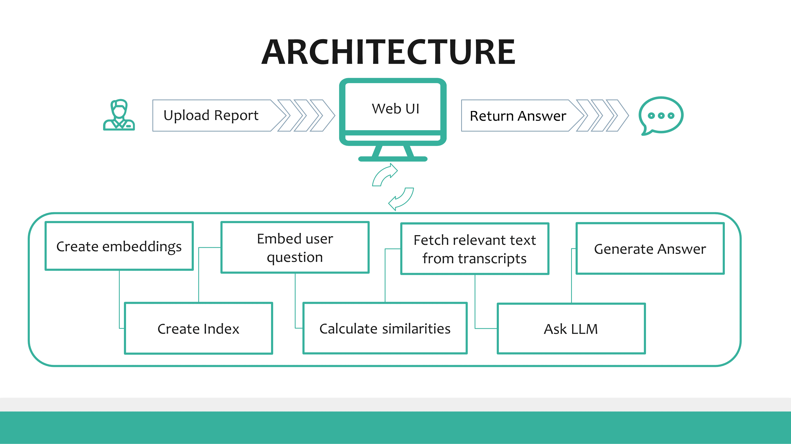
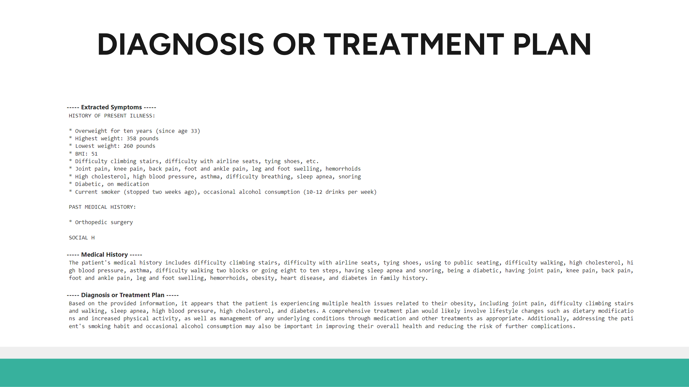
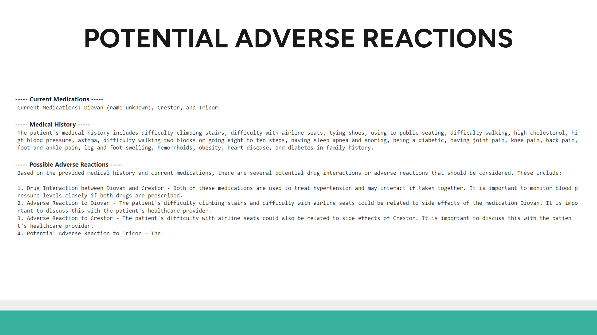
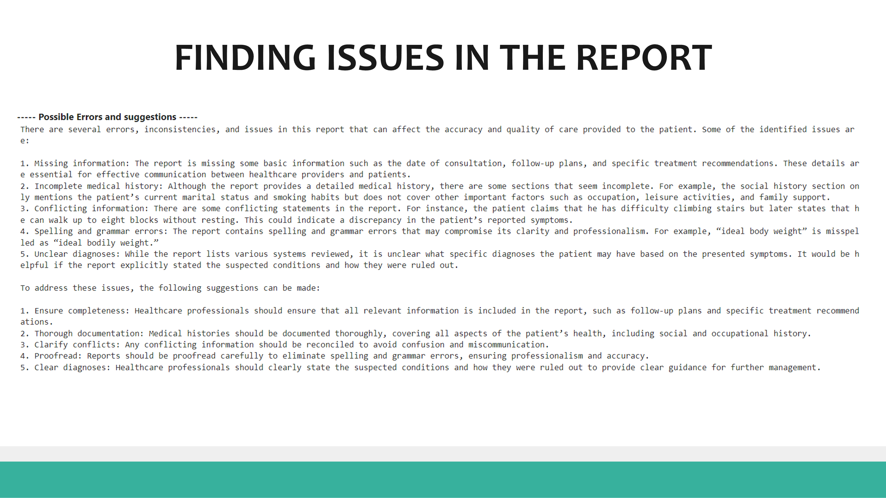
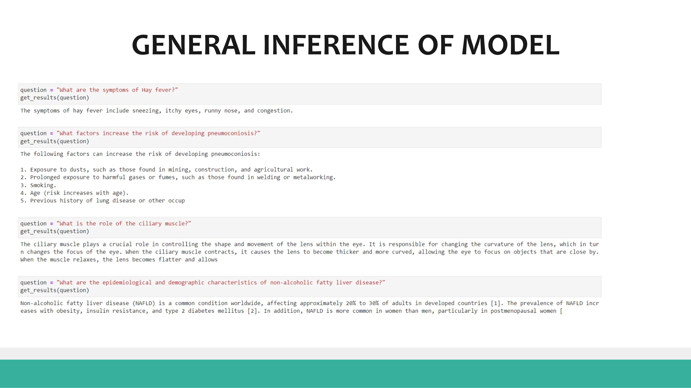
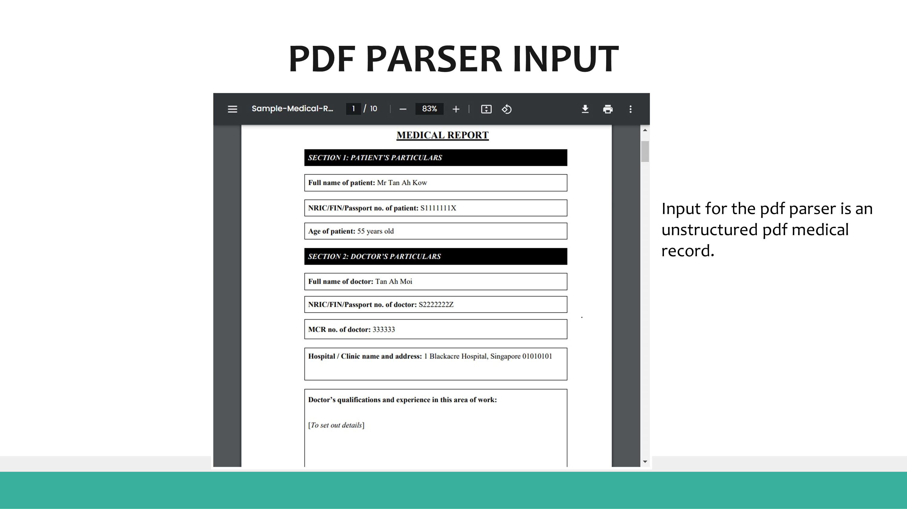
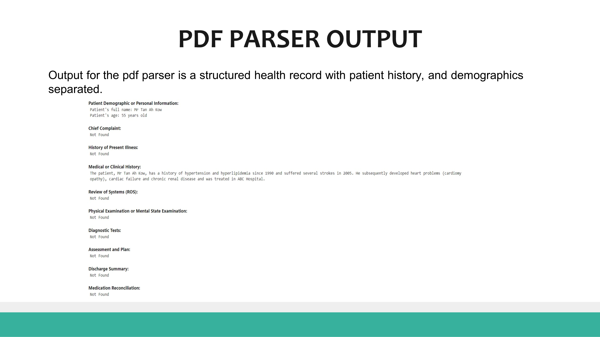
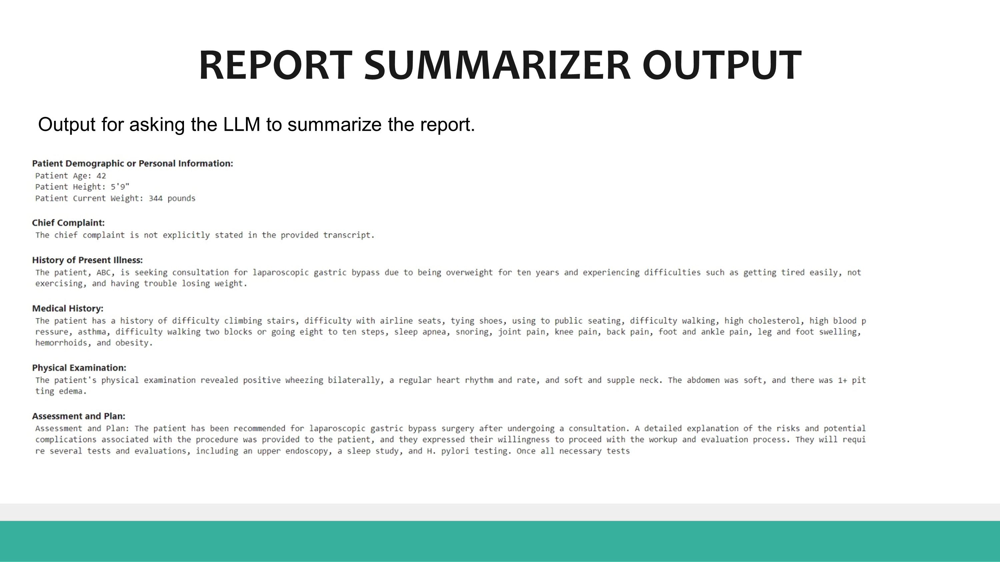

# DocScribe: Medical QA Chatbot

## Introduction
DocScribe is a medical question-and-answer chatbot that revolutionizes how we interact with medical data. DocScribe provides quick, accurate responses to both general medical inquiries and patient-specific questions. Our main goal is to enhance medical report accessibility and comprehension. DocScribe achieves this through:

- Transcription of medical reports into a more accessible format.
- Providing answers to general medical questions.
- Summarizing reports from multiple visits.
- Identifying relevant information from patient history.

## Architecture
DocScribe's architecture facilitates a seamless interaction between users and medical data. It incorporates:
- A Jupyter Notebook-based Web UI for uploading reports and further interaction.
- The creation of embeddings and indexes from medical transcripts.
- The utilization of LangChain and HuggingFace frameworks for processing and answering questions.




## Data Sources
Our project leverages a diverse range of data sources to train our model, including:
- Medical Transcripts: We leveraged the GPT-3.5 model to generate 4.5k QA prompts from the medical transcripts. [MTSamples](https://mtsamples.com/)
- WikiDoc: [Visit WikiDoc](https://huggingface.co/datasets/medalpaca/medical_meadow_wikidoc)
- WikiPatient: [Visit WikiPatient](https://huggingface.co/datasets/medalpaca/medical_meadow_wikidoc_patient_information)

### Sample Data

| Dataset     | Instruction                                       | Input                                                                                      | Output                                                                                                                                                           |
|-------------|---------------------------------------------------|--------------------------------------------------------------------------------------------|------------------------------------------------------------------------------------------------------------------------------------------------------------------|
| Wikidoc     | Answer this question truthfully                   | Can you provide an overview of the lung's squamous cell carcinoma?                        | Squamous cell carcinoma of the lung may be classified according to the WHO histological classification system into 4 main types: papillary, clear cell, small cell, and basaloid. |
| WikiPatient | Answer this question truthfully                   | When to seek urgent medical care when I have Alstrom syndrome?                            | Call your healthcare provider if you or your child have symptoms of diabetes such as increased thirst and urination. Seek medical attention promptly if you think that your child cannot see or hear normally.          |
| MT Samples  | Based on the given medical transcript generate prompt and answer to train LLM | What was the patient's preoperative diagnosis?                                            | The patient's preoperative diagnosis was prostate cancer.                                                                                                         |


## Modeling Approach
We opted for the Vicuna-13B model, fine-tuned with LoRA, PEFT, and bitsandbytes. Our approach was validated through rigorous testing and has shown promising results in interpreting medical data.

## Sample Results
<table>
  <tr>
    <td>
      
    </td>
    <td>
      
    </td>
  </tr>
  <tr>
    <td>
      
    </td>
    <td>
      
    </td>
  </tr>
  <tr>
    <td>
      
    </td>
    <td>
      
    </td>
  </tr>
  <tr>
    <td>
      
    </td>
    <td>
      
    </td>
  </tr>
  <tr>
    <td>
      
    </td>
    <td>
      
    </td>
  </tr>
  <tr>
    <td>
      
    </td>
    <td>
      
    </td>
  </tr>
</table>

## Results & Future Work
DocScribe has shown remarkable proficiency in processing medical queries and summarizing patient reports. Future directions include expanding the model's training on medical corpuses, incorporating medical image analysis, and exploring its application in clinical research.

## Installation
```bash
git clone https://github.com/kmnis/DocScribe.git
cd DocScribe
pip install -r requirements.txt

# Start the jupyter server by running
jupyter notebook

# Open your browser and open http://localhost:8888/inference and open a notebook
```

---

## Team
- Manish Kumar (mnis@uchicago.edu)
- Kargil Thakur (kargil@uchicago.edu)
- Ekansh Trivedi (ekansh@uchicago.edu)

## 📈 Star History

[](https://star-history.com/#kmnis/DocScribe&Date)
